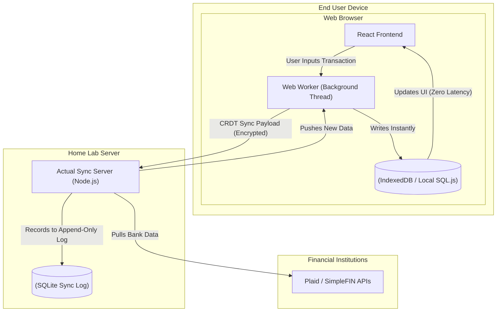

### What is Actual Budget?

Actual is a highly responsive, privacy-focused personal finance and budgeting application built on the principles of zero-based budgeting (a method where every dollar is assigned a specific job before the month begins). 

Originally, Actual was a proprietary, paid SaaS (Software as a Service) product. However, its creator open-sourced the entire codebase, allowing the self-hosted community to run the backend synchronization server entirely for free.

#### Architectural Overview: Local-First Web Apps

Actual represents a massive paradigm shift in modern web development known as **"Local-First Architecture."** Unlike traditional web apps (like Mint or YNAB) that constantly query a cloud database for every click and page load, Actual's web client runs the entire application database locally inside the user's browser.



When you open Actual Budget, the entire application loads into your browser's memory using `SQL.js` (SQLite compiled to WebAssembly) and IndexedDB for persistent browser storage. 

When you enter a transaction, it is written *immediately* to the local database, resulting in literally zero latency. In the background, a Web Worker negotiates with your home lab server using CRDTs (Conflict-Free Replicated Data Types) to sync the changes with any other devices you own. 

---

### The Home Lab Role

Financial data is arguably the most sensitive personal information a user can generate. Cloud-based budgeting apps inherently have access to your spending habits, net worth, and exact location history. 

By self-hosting the Actual server:
- **Absolute Privacy:** You ensure that this highly sensitive data remains strictly within your physical control. Actual even supports End-to-End Encryption (E2EE) between your browser and your home server, meaning the server only ever sees encrypted blobs of data.
- **Offline Reliability:** Because the application is local-first, you can balance your budget on an airplane without Wi-Fi. The moment you reconnect to your home server, all offline changes are seamlessly merged.
- **Bank Synchronization:** Actual integrates with open-source banking APIs (like SimpleFIN) to securely pull transaction data directly from your bank into your home lab, bypassing massive data brokers like Plaid.

---

### Real-World Deployment Scenarios

Local-first architecture is heavily researched and increasingly adopted by modern enterprise software teams who require extreme performance and offline capabilities.

1. **Collaborative Software:** Applications like Google Docs, Figma, and Notion rely heavily on CRDTs and local-first principles to allow multiple users to edit the same document simultaneously without causing merge conflicts.
2. **SaaS to Open Source Transition:** Actual Budget is a brilliant case study in how to transition a monolithic commercial product into a decentralized, community-driven application using Docker containers.
3. **WebAssembly (Wasm) in Production:** Actual compiles a C-based SQLite database into WebAssembly so it can run directly inside the V8 JavaScript engine. This represents the bleeding edge of web development, blurring the line between desktop applications and web pages.

---

### Configuration Snippet: Infrastructure as Code

Deploying the Actual synchronization server is incredibly straightforward, as the Node.js backend requires very few resources.

```yaml
version: '3'
services:
  actual-server:
    image: actualbudget/actual-server:latest
    container_name: actual_budget
    ports:
      # Expose the sync server on port 5006
      - '5006:5006'
    environment:
      # Tell the server where it will be accessed from
      - ACTUAL_SERVER_URL=https://budget.mydomain.com
    volumes:
      # Persistent storage for user accounts and the SQLite sync log
      - ./actual-data:/data
    restart: unless-stopped
```

Once running, administrators access the URL, create a password, and optionally enable E2EE. From that point on, the server simply acts as a dumb, secure relay that blindly accepts and merges encrypted CRDT payloads from the clients.

---

### Educational Value for IT Students

Actual Budget is a brilliant case study in modern web application design, offering IT students exposure to advanced frontend engineering concepts:

- **Local-First Architecture:** Students learn how modern Progressive Web Apps (PWAs) utilize IndexedDB, Web Workers, and WebAssembly to operate completely offline.
- **Conflict-Free Replicated Data Types (CRDTs):** Understanding the complex computer science mathematics required to allow multiple offline clients to edit the same database row without generating merge conflicts.
- **Data Security & Privacy:** Learning why keeping sensitive SQL databases isolated on a private LAN—and utilizing End-to-End Encryption (E2EE)—is vastly superior to trusting third-party cloud hosts.
- **Reverse Proxy Configurations:** Securing a financial app requires setting up robust TLS certificates and configuring reverse proxies to handle WebSocket connections properly.
