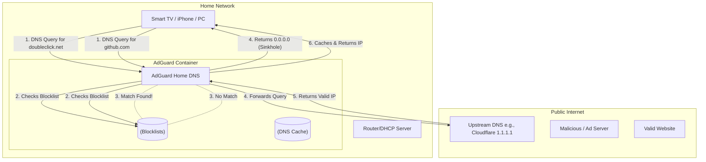

### What is AdGuard Home?

AdGuard Home is a powerful, network-wide software application designed to intercept and block advertisements, tracking domains, and malicious websites across your entire network. Unlike traditional browser extensions (like uBlock Origin) that only protect a single web browser, AdGuard Home operates at the infrastructure level as a **DNS Sinkhole**. 

Because it operates at the network level, it covers every single device connected to your home lab—including smart TVs, IoT devices, mobile phones, and tablets—without requiring any client-side software installation.

#### Architectural Overview

The Domain Name System (DNS) is often called the "phonebook of the internet," translating human-readable domain names (like `google.com`) into machine-readable IP addresses (like `142.250.190.46`). AdGuard Home intercepts these DNS queries before they reach the public internet.



When a device requests the IP address for a known tracking domain, AdGuard Home instantly returns a "null" address (like `0.0.0.0`). The device's browser or app attempts to connect to the null address, fails instantly, and the ad simply disappears from the screen.

---

### The Home Lab Role

In a home lab environment, AdGuard Home is typically deployed as a Docker container or directly onto a low-power device like a Raspberry Pi. 

To route traffic to it, the lab administrator modifies the **DHCP (Dynamic Host Configuration Protocol)** settings on their primary router. Instead of the router telling devices to use the ISP's default DNS servers, the router instructs every device on the network to use the AdGuard Home server's internal IP address for DNS resolution.

- **Encrypted DNS:** ISPs frequently log and sell user browsing data based on DNS queries. AdGuard Home can be configured to use DNS-over-HTTPS (DoH) or DNS-over-TLS (DoT) to encrypt queries to upstream providers (like Quad9 or Cloudflare), preventing the ISP from snooping on traffic.
- **Custom DNS Records:** AdGuard Home allows administrators to create "DNS Rewrites." This is essential for a home lab, as it allows you to map human-readable domain names (e.g., `nas.local`) directly to internal IP addresses (e.g., `192.168.1.50`), completely bypassing public DNS routing.
- **Parental Controls & Safe Search:** The platform allows administrators to enforce Safe Search on Google and YouTube across the entire network, or block specific services (like TikTok or Facebook) during specific hours.

---

### Real-World Deployment Scenarios

Understanding DNS filtering is highly applicable to enterprise IT security. In corporate environments, DNS filtering is a critical layer of defense against malware and ransomware.

1. **Phishing Protection:** Enterprise DNS filters (like Cisco Umbrella) operate on the exact same principles as AdGuard Home. If an employee clicks a phishing link in an email, the DNS sinkhole prevents the browser from resolving the malicious domain, stopping the attack before any connection is made.
2. **Telemetry Blocking:** Corporations frequently use DNS filtering to block unwanted telemetry from IoT devices, printers, and even Windows 10/11 operating systems from "phoning home" to manufacturer servers.
3. **Split-Brain DNS:** Enterprises use internal DNS servers to resolve internal company resources (e.g., `intranet.corp.local`) while forwarding external queries to public providers. AdGuard's DNS Rewrite feature functions exactly like an enterprise split-brain DNS setup.

---

### Configuration Snippet: Infrastructure as Code

Deploying AdGuard Home via Docker Compose ensures that its configuration and blocklists are persistent and version-controlled.

```yaml
version: '3.8'

services:
  adguardhome:
    image: adguard/adguardhome
    container_name: adguardhome
    restart: unless-stopped
    # AdGuard requires host networking to correctly identify 
    # the individual IP addresses of clients making requests
    network_mode: host
    volumes:
      # Persistent storage for configuration and blocklists
      - ./work:/opt/adguardhome/work
      # Persistent storage for configuration files
      - ./conf:/opt/adguardhome/conf
    ports:
      # Port 53 is the standard port for DNS traffic (TCP and UDP)
      - "53:53/tcp"
      - "53:53/udp"
      # Port 3000 is used for the initial setup web interface
      - "3000:3000/tcp"
      # Port 80 for the main web dashboard
      - "80:80/tcp"
```

Once running, administrators simply log into the dashboard on port 80, subscribe to community-maintained blocklists (like the OISD or StevenBlack lists), and watch the query logs populate in real-time.

---

### Educational Value for IT Students

For IT students, deploying a DNS sinkhole provides an incredible visual representation of how the internet actually functions under the hood.

- **DNS Fundamentals:** Students learn the critical difference between authoritative DNS servers, recursive resolvers, and local caches. They also gain hands-on experience with DNS record types (A, CNAME, TXT).
- **Network Traffic Analysis:** The AdGuard query log is an eye-opening look at the sheer volume of telemetry generated by modern devices. Students learn how to analyze these logs to identify misbehaving devices or isolate malware.
- **DHCP Management:** Forcing network-wide adoption requires modifying DHCP scopes, teaching students how IP addresses, subnet masks, gateways, and DNS servers are distributed across a LAN.
- **Privacy & Telemetry:** It fosters a critical understanding of the modern surveillance economy, demonstrating exactly how data brokers track users across websites and applications via hidden background domains.
