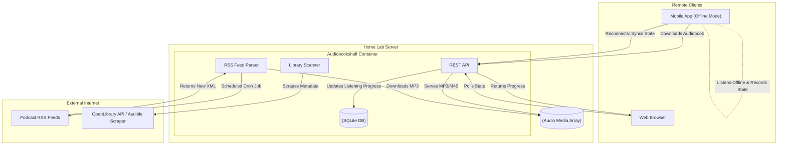

### What is Audiobookshelf?

Audiobookshelf is a fully self-hosted podcast and audiobook server. It provides a robust web interface and dedicated mobile applications (available for both iOS and Android) allowing users to stream or download audio content.

While generic media servers like Jellyfin can technically play audio files, they are fundamentally designed for video content and lack the highly specialized features necessary for spoken-word media. Audiobookshelf fills this niche perfectly, acting as a decentralized, private alternative to commercial platforms like Audible or Spotify.

#### Architectural Overview: Asynchronous State Synchronization

The most complex technical challenge of an audiobook platform is maintaining state across multiple, frequently offline devices. If a user listens to an audiobook on their phone during a commute (without internet access) and then opens their web browser at home, the server must correctly synchronize their listening progress down to the second.



This architecture relies heavily on robust database synchronization. When the mobile app regains connectivity, it pushes a payload containing its local state to the REST API, which reconciles it with the SQLite database, ensuring all clients stay perfectly in sync.

---

### The Home Lab Role

Audiobookshelf handles complex audio metadata (such as nested chapters, multiple narrators, and book series) that standard video servers simply ignore. 

- **State Tracking:** It tracks your listening progress down to the second, saving bookmarks and syncing them across every device.
- **Automated Podcasts:** By subscribing to public RSS feeds, the server acts as an automated agent. It periodically polls the feeds, automatically downloads new podcast episodes as soon as they are published, and organizes them into chronological directories.
- **Privacy & Archival:** Purchasing an audiobook on Audible merely grants you a license to stream it, which Amazon can revoke at any time. Self-hosting audiobooks as DRM-free `.m4b` files guarantees permanent archival access to your digital library.

---

### Real-World Deployment Scenarios

Deploying specialized media servers like Audiobookshelf provides direct experience with several fundamental computer science and web development concepts used in the enterprise.

1. **State Synchronization:** The challenge of syncing offline client data with a central server without overwriting newer data (conflict resolution) is a massive hurdle in modern mobile app development (often solved using CRDTs or timestamped reconciliation).
2. **Asynchronous Polling:** Enterprise applications frequently need to ingest data from thousands of external sources. Audiobookshelf's RSS parsing engine operates exactly like an enterprise cron job, polling remote XML endpoints, parsing the data, and triggering asynchronous download queues.
3. **Metadata Normalization:** Dealing with embedded ID3 tags in audio files is notoriously difficult due to a lack of standardization. Building systems that can parse, normalize, and correct messy user-provided data is a core competency in data engineering.

---

### Configuration Snippet: Infrastructure as Code

Audiobookshelf is lightweight and stores all its configuration and metadata in a SQLite database, making it incredibly easy to deploy and back up.

```yaml
version: "3.7"
services:
  audiobookshelf:
    image: ghcr.io/advplyr/audiobookshelf:latest
    container_name: audiobookshelf
    ports:
      - 1337:80
    volumes:
      # The main audio files (Read/Write to allow downloading podcasts)
      - /mnt/storage/audiobooks:/audiobooks
      - /mnt/storage/podcasts:/podcasts
      # Configuration and SQLite Database
      - ./config:/config
      # Cache for metadata scraping
      - ./metadata:/metadata
    environment:
      - TZ=America/Chicago
    restart: unless-stopped
```

Notice that unlike the Jellyfin configuration (where media directories are mounted as `ro` or Read-Only), Audiobookshelf requires read/write access to the `podcasts` directory so it can save newly downloaded MP3s directly to the file system.

---

### Educational Value for IT Students

This project beautifully demonstrates how specialized applications handle data differently than generalized ones. Deploying it teaches students:

- **Database Synchronization:** How a central server maintains state and pushes updates to offline mobile clients using REST APIs.
- **RSS Feed Parsing:** Understanding how XML feeds are structured, and how automated background jobs poll these endpoints to scrape and download new digital content asynchronously.
- **Metadata Management:** Dealing with the intricacies of embedded ID3 tags, `.m4b` chapter markers, and structuring complex directory hierarchies for consistent parsing by the library scanner.
