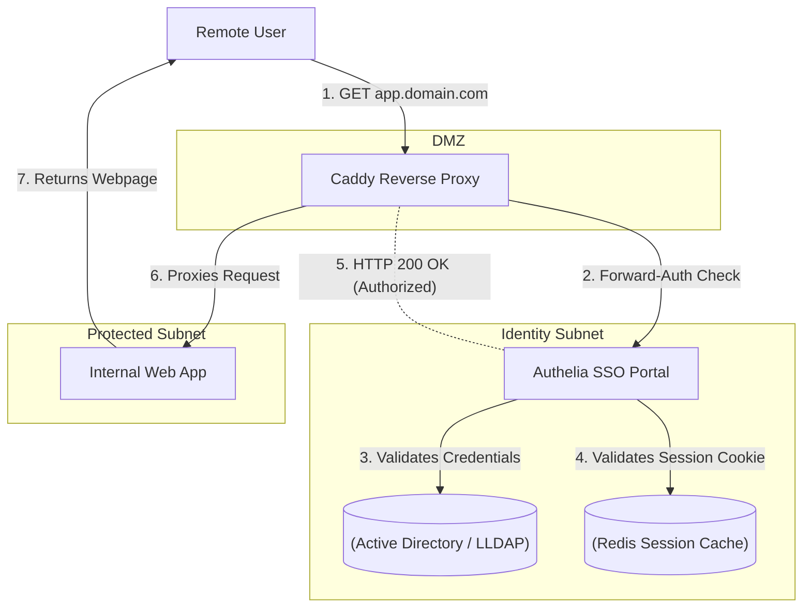

### What is Authelia?

Authelia is an open-source, full-featured authentication and authorization server providing Two-Factor Authentication (2FA) and Single Sign-On (SSO) for your applications via a web portal. 

While reverse proxies (like Caddy or Nginx) are excellent at routing traffic, they are not designed to natively handle complex identity management (like checking passwords against an LDAP server, generating time-based one-time passwords, or interacting with hardware security keys). Authelia fills this void. It acts as a companion "middleware" for your reverse proxy to let it know whether a specific user should be granted access to a protected resource.

#### Architectural Overview: The Forward-Auth Pattern

Authelia utilizes a highly secure architectural pattern known as "Forward Authentication" (or Forward-Auth). 

When a user attempts to access a protected application, the traffic flow looks like this:



1. The user attempts to visit the protected web app.
2. The reverse proxy pauses the request and sends a sub-request to Authelia, asking: "Is this user allowed here?"
3. If the user does not have a valid session cookie, Authelia tells the proxy to redirect the user to the central Authelia login screen.
4. The user logs into Authelia with their username, password, and a 2FA token (like a YubiKey or Google Authenticator code).
5. Authelia sets a secure session cookie in the user's browser and redirects them back to the original app.
6. The proxy asks Authelia again. This time, Authelia sees the valid cookie and returns an `HTTP 200 OK`.
7. The proxy allows the traffic to pass through to the backend application.

---

### The Home Lab Role

When you expose internal services to the internet—such as your personal dashboard, a file syncing server, or your media stack—relying on their built-in login screens (if they even have one) is exceptionally risky. Many self-hosted apps have weak password policies, lack brute-force protection, and do not support multi-factor authentication.

Authelia allows you to put a secure, unified, heavily armored "front door" in front of your entire home lab. 
- **Zero Trust Security:** Even if an attacker discovers the URL to your internal router management page, they cannot even view the login screen without first passing through Authelia's 2FA challenge.
- **Single Sign-On (SSO):** Once you authenticate with Authelia, you are granted a session cookie valid for a specific duration. You can seamlessly bounce between all your self-hosted apps without ever having to log in again.
- **Granular Access Control:** Authelia's configuration allows you to define complex rules. For example, you can allow access to the blog without authentication, require only a password for the media server, but require a hardware security key to access the Proxmox hypervisor.

---

### Real-World Deployment Scenarios

Identity and Access Management (IAM) is arguably the most critical component of modern enterprise security. Authelia's architecture is identical to the enterprise SSO solutions deployed by Fortune 500 companies.

1. **Enterprise SSO:** In the corporate world, employees use platforms like Okta, Duo Security, or Microsoft Entra ID (formerly Azure AD) to log into their workstations and cloud applications. Authelia is the self-hosted, open-source equivalent of these multi-billion-dollar IAM platforms.
2. **Zero Trust Network Access (ZTNA):** Modern enterprises are shifting away from traditional VPNs toward a "Zero Trust" model, where every single HTTP request is cryptographically verified before being allowed to hit an internal server. Authelia enforces this exact paradigm.
3. **Identity Federation:** Authelia supports OpenID Connect (OIDC), a modern authentication protocol that allows it to act as an Identity Provider (IdP) for services that natively support SSO (like Nextcloud or Proxmox), unifying identity across the entire organization.

---

### Configuration Snippet: Caddy Forward-Auth

To integrate Authelia with Caddy, you must configure Caddy to perform the forward-auth sub-request before allowing traffic to pass to the backend. 

Here is an example Caddyfile snippet protecting an internal dashboard:

```text
dashboard.mydomain.com {
    # 1. Send a forward-auth request to the Authelia container
    forward_auth authelia:9091 {
        uri /api/verify?rd=https://auth.mydomain.com
        copy_headers Remote-User Remote-Groups Remote-Name Remote-Email
    }

    # 2. If Authelia returns HTTP 200 OK, proxy the traffic to the dashboard
    reverse_proxy internal_dashboard:80
}

# The Authelia portal itself
auth.mydomain.com {
    reverse_proxy authelia:9091
}
```

In this setup, Caddy is not only verifying authorization, but it is also using `copy_headers` to inject the authenticated user's name and email directly into the HTTP headers sent to the backend application, allowing the backend app to automatically log the user in.

---

### Educational Value for IT Students

Implementing a central Identity Provider (IdP) is a complex, capstone-level project for IT students. Deploying Authelia teaches critical cybersecurity and IAM competencies:

- **Authentication Flows:** Students learn the fundamental mechanics of Single Sign-On, stateful session cookies, and cross-domain authentication.
- **Multi-Factor Authentication (MFA):** The project demystifies the cryptography behind Time-based One-Time Passwords (TOTP), WebAuthn, FIDO2, and hardware security keys.
- **Directory Services:** To use Authelia effectively, students must integrate it with a backend user directory (like LDAP or Active Directory), teaching them how user objects, groups, and organizational units (OUs) are structured and queried in the enterprise.
- **Proxy Middleware:** Configuring forward-auth teaches students how reverse proxies manipulate HTTP headers and HTTP status codes to control the flow of network traffic.
