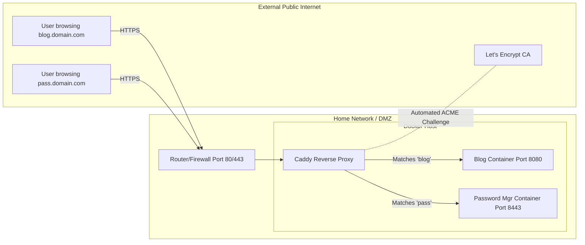

### What is Caddy?

Caddy is an incredibly powerful, enterprise-grade, open-source web server written in Go. While it can serve static websites just like Apache or Nginx, its defining feature—and the reason it has exploded in popularity among homelabbers and DevOps professionals—is its role as an automated **Reverse Proxy**.

A reverse proxy is a server that sits at the edge of your network, intercepts incoming web traffic, and seamlessly routes that traffic to the correct internal server (or container) based on the domain name requested. Most impressively, Caddy is the only major web server that automates the provisioning, renewal, and installation of Let's Encrypt SSL/TLS certificates by default, requiring exactly zero manual configuration to achieve a perfect A+ security rating.

#### Architectural Overview

To understand the necessity of a reverse proxy, consider a network *without* one. If you host a blog on port 8080 and a password manager on port 8443, you would have to expose both ports through your router's firewall and force users to type URLs like `http://myip:8080`. 

Caddy fundamentally solves this routing and security nightmare:



All external traffic hits the router on standard HTTPS port 443. Caddy inspects the incoming request's SNI (Server Name Indication) header, determines which subdomain the user is asking for, secures the connection with its automatically managed SSL certificate, and acts as a middleman to the internal container.

---

### The Home Lab Role

In a self-hosted architecture, exposing raw HTTP services directly to the internet is a catastrophic security vulnerability, as passwords and session cookies would be transmitted in plain text. Caddy acts as the singular, heavily armored front door for the entire lab.

- **Zero-Touch HTTPS:** Caddy eliminates the need to run manual `certbot` commands or create complicated cron jobs to renew expiring certificates. If Caddy is running, your sites are secure.
- **Port Consolidation:** By routing everything through port 443, administrators don't need to open dozens of obscure ports on their hardware firewall, drastically reducing the external attack surface.
- **Load Balancing & Retries:** Caddy can easily be configured to load balance traffic across multiple identical backend containers, or automatically retry a request if a backend server temporarily crashes.

---

### Real-World Deployment Scenarios

In the enterprise, reverse proxies are the backbone of modern web infrastructure. While tools like Nginx and HAProxy dominate legacy environments, Caddy is rapidly gaining market share in modern, cloud-native deployments due to its API-driven configuration and memory-safe Go architecture.

1. **Ingress Controllers:** In Kubernetes clusters, reverse proxies act as "Ingress Controllers," dynamically updating their routing tables as new pods (containers) are spun up or destroyed.
2. **API Gateways:** Reverse proxies frequently act as API gateways, stripping SSL overhead, authenticating requests with JSON Web Tokens (JWTs), and then passing the raw, unencrypted HTTP request to the internal microservices on a secure backend LAN.
3. **Automated Fleet Management:** Caddy supports distributed certificate storage (e.g., storing SSL certificates in a shared Redis database), allowing a fleet of dozens of Caddy servers to seamlessly share the same Let's Encrypt certificates across a global load balancer.

---

### Configuration Snippet: The Caddyfile

One of Caddy's greatest strengths is its configuration syntax, known as the `Caddyfile`. Compared to the hundreds of lines of cryptic directives required to configure SSL and reverse proxying in Nginx or Apache, Caddy achieves the same result in just a few lines.

Here is an example `Caddyfile` that automatically secures two domains and proxies them to internal Docker containers:

```text
# Global options block
{
    # Provide an email for Let's Encrypt account registration
    email admin@mydomain.com
}

# Site 1: The Personal Blog
blog.mydomain.com {
    # Automatically gzip compress text assets
    encode gzip
    
    # Proxy all incoming traffic to the internal Ghost blog container
    reverse_proxy ghost_blog:2368
}

# Site 2: The Password Manager
vault.mydomain.com {
    # Block access from IP addresses outside the local network for security
    @denied not remote_ip 192.168.1.0/24 10.0.0.0/8
    abort @denied

    # Proxy traffic to the internal Bitwarden container
    reverse_proxy bitwarden:80
}
```

When Caddy starts, it reads this file, realizes it does not have SSL certificates for `blog.mydomain.com` or `vault.mydomain.com`, instantly contacts Let's Encrypt to perform an ACME DNS or HTTP challenge, downloads the certificates, and begins securely proxying traffic—all in under 5 seconds.

---

### Educational Value for IT Students

Configuring a reverse proxy is a mandatory, non-negotiable skill for modern systems and web administrators. Implementing Caddy teaches students critical foundational concepts:

- **DNS & Routing:** Students must learn how to configure A and CNAME records at their domain registrar, and understand how traffic physically routes from the public internet through a NAT firewall to an internal gateway.
- **Cryptography & PKI:** Caddy forces students to understand the mechanics of Public Key Infrastructure (PKI), the difference between HTTP and HTTPS, and how automated ACME (Automated Certificate Management Environment) challenges prove domain ownership.
- **Network Topologies:** Deploying a reverse proxy teaches students the concept of a DMZ (Demilitarized Zone), where a hardened proxy server sits between the hostile public internet and the vulnerable internal LAN services.
- **HTTP Headers:** Students learn how to manipulate HTTP request headers (like `X-Forwarded-For`), ensuring that backend applications record the actual client's IP address rather than the proxy server's internal IP.
