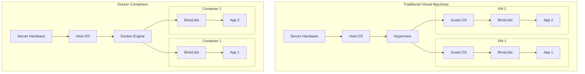

### What is Docker?

Docker is an open-source platform that revolutionizes how developers build, ship, and run applications. At its core, Docker automates the deployment of applications inside lightweight, portable, and self-sufficient environments known as **containers**. 

To truly understand Docker, it is crucial to contrast it with traditional Virtual Machines (VMs). A traditional VM requires a "hypervisor" (like VMware ESXi or Microsoft Hyper-V) to emulate virtual hardware. On top of this virtual hardware, an entire Guest Operating System (like Ubuntu or Windows Server) is installed, which then runs the necessary binaries, libraries, and the application itself. This means running three VMs on a host requires running three complete, independent operating systems, consuming massive amounts of CPU, RAM, and storage overhead.

Docker fundamentally changes this paradigm. Instead of virtualizing hardware, Docker virtualizes the operating system. All Docker containers share the host machine's single OS kernel. The container itself only packages the application code and its specific dependencies (libraries, binaries, and configuration files). 

#### Architectural Comparison

To visualize the efficiency gains, examine the architectural difference between VMs and Containers:



Because containers bypass the need to boot an entire OS, they can start in milliseconds, require only megabytes of disk space, and incur virtually zero performance overhead.

---

### The Home Lab Role

In the context of a self-hosted architecture, Docker is the absolute foundational building block. The days of installing applications directly onto a bare-metal Linux server (using `apt-get install` or `make`) are long gone. Installing packages directly leads to "Dependency Hell"—a scenario where App A requires Python 3.8, but App B requires Python 3.10, and installing one breaks the other.

By running almost every service—from reverse proxies to media centers—as isolated Docker containers, you achieve a clean, modular, and indestructible environment. 
- **Isolation:** If a container is compromised or crashes, it cannot affect the host system or other containers.
- **Portability:** Moving a home lab to a new physical server is as simple as copying a configuration file and running a single command. The new server will download identical, bit-for-bit copies of the containers and spin them up exactly as they were.
- **Rollbacks:** Because containers are built from immutable "Images" (read-only templates), reverting a broken software update simply involves telling Docker to spin up the previous version's image tag.

---

### Real-World Deployment Scenarios

Understanding Docker in a home lab directly translates to enterprise environments. In the real world, the workflow looks like this:

1. **Development:** A developer writes code on their local laptop and creates a `Dockerfile`—a script detailing exactly what base OS, libraries, and commands are needed to run the app.
2. **Continuous Integration (CI):** The code is pushed to a repository (like GitHub). An automated pipeline reads the `Dockerfile`, builds a container Image, and tests it.
3. **Registry:** The built Image is pushed to a centralized registry (like Docker Hub or Amazon ECR).
4. **Production:** Servers pull the Image from the registry and spin it up as a running Container. Because the container contains everything the app needs, the developer's classic excuse—"It worked on my machine!"—is entirely eliminated. It runs exactly the same in production as it did on the laptop.

In a home lab, you are acting as both the developer and the operations engineer (DevOps), pulling pre-built images from Docker Hub and orchestrating them on your local server.

---

### Configuration Snippet: Infrastructure as Code

While you can start containers using long `docker run` terminal commands, modern deployments utilize **Docker Compose**. Docker Compose allows you to define your entire infrastructure as code (IaC) using a simple YAML file. 

Here is an example of a `docker-compose.yml` file deploying a standard Nginx web server:

```yaml
version: '3.8'

services:
  webserver:
    # Pull the official, lightweight Alpine-based Nginx image
    image: nginx:alpine
    
    # Restart the container automatically if the server reboots or the app crashes
    restart: unless-stopped
    
    # Map port 80 inside the container to port 8080 on the host machine
    ports:
      - "8080:80"
      
    # Mount a local directory into the container to serve custom HTML
    volumes:
      - ./my-website-data:/usr/share/nginx/html:ro
      
    # Assign the container a static IP on a custom virtual network
    networks:
      backend_net:
        ipv4_address: 172.20.0.10

networks:
  backend_net:
    driver: bridge
    ipam:
      config:
        - subnet: 172.20.0.0/16
```

To deploy this stack, an administrator simply navigates to the directory containing this file and runs `docker-compose up -d`. Docker Engine will automatically download the Nginx image, create the virtual network, map the storage volumes, and start the service in the background.

---

### Educational Value for IT Students

For students entering the IT field, mastering Docker is arguably the single most critical skill to develop for modern cloud engineering and DevOps. Deploying this platform teaches you the fundamentals of:

- **Linux Fundamentals:** Containers are heavily reliant on Linux kernel features like `cgroups` (Control Groups for resource limitation) and `namespaces` (for process isolation). Managing Docker forces students to become comfortable with the Linux CLI, permissions, and file systems.
- **Networking Dynamics:** Creating virtual bridge networks, exposing ports, and routing traffic between isolated containers provides practical experience with subnets, NAT (Network Address Translation), and DNS.
- **Infrastructure as Code (IaC):** Writing `docker-compose.yml` files shifts the mindset away from manual server configuration (which is error-prone and untrackable) toward declarative, version-controlled infrastructure definition.
- **Microservices Architecture:** Learning how to break a monolithic application down into smaller, decoupled services (e.g., separating the web frontend from the database backend) that communicate over internal APIs.
