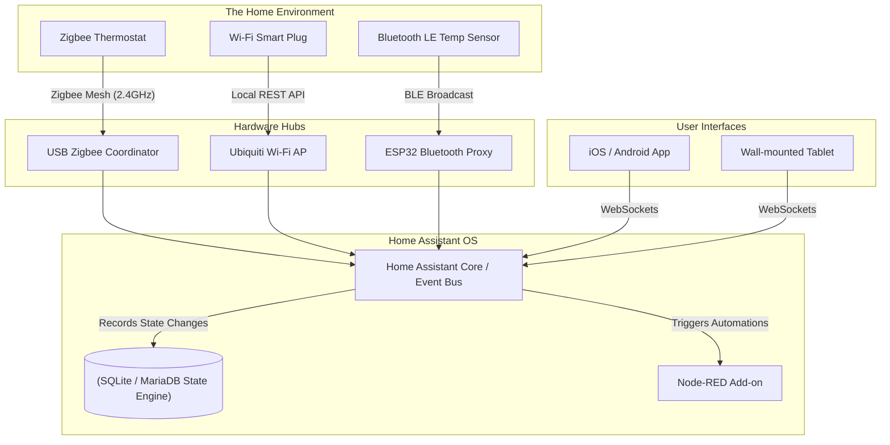

### What is Home Assistant?

Home Assistant is the world's most popular open-source home automation platform. Designed to be the central control system (the "brain") for a smart home, it puts local control, data privacy, and extreme interoperability first. Powered by a worldwide community of developers, Home Assistant integrates seamlessly with over 2,500 different brands, protocols, and APIs.

Unlike commercial smart home hubs (like Amazon Echo, Google Home, or Samsung SmartThings), which act as thin clients that send your data to corporate cloud servers for processing, Home Assistant processes every single command locally on your hardware.

#### Architectural Overview: The Local IoT Hub

The true power of Home Assistant lies in its ability to unify disparate, entirely incompatible IoT ecosystems into a single state machine. 



Whether a sensor communicates via a low-power Zigbee mesh network, an encrypted Wi-Fi REST API, or a Bluetooth Low Energy broadcast, Home Assistant's core event bus translates those signals into standard "entities" (e.g., `sensor.living_room_temp`). This allows a Zigbee motion sensor to instantly turn on a Wi-Fi lightbulb—an interaction that would be impossible using the manufacturers' proprietary apps.

---

### The Home Lab Role

In a home lab, Home Assistant is often the project with the highest "Spouse Acceptance Factor." It transforms abstract server infrastructure into tangible, real-world utility. 

- **Local Reliability:** Because automation rules are processed locally, your smart lights, security cameras, and HVAC routines continue to function perfectly even if your ISP goes offline or an AWS data center crashes.
- **Data Privacy:** Big Tech companies heavily subsidize their smart home hardware to harvest and sell telemetry data (e.g., when you wake up, when you leave the house, what temperature you prefer). Home Assistant keeps this highly personal behavioral data locked safely inside your local database.
- **Advanced Automations:** Commercial hubs rely on simplistic "If This, Then That" logic. Home Assistant supports incredibly complex scripts involving nested conditional logic, variables, loops, and mathematical templates. 

---

### Real-World Deployment Scenarios

The protocols and scripting logic used in Home Assistant are directly analogous to Industrial IoT (IIoT) and enterprise telemetry systems.

1. **SCADA Systems:** In manufacturing and utility plants, SCADA (Supervisory Control and Data Acquisition) systems monitor thousands of physical sensors (temperature, pressure, voltage) and trigger automated industrial responses. Home Assistant is effectively a SCADA system for residential architecture.
2. **MQTT Telemetry:** Home Assistant heavily utilizes MQTT, a lightweight publish/subscribe messaging protocol. MQTT was originally designed for the oil and gas industry to monitor pipelines over satellite links, and is now the global standard for enterprise IoT communication.
3. **API Aggregation:** In enterprise software engineering, developers frequently build "middleware" that polls multiple distinct REST APIs, normalizes the data, and presents it in a unified dashboard. Home Assistant's integration ecosystem does exactly this for thousands of third-party web services (e.g., pulling weather data, stock prices, or transit schedules).

---

### Configuration Snippet: Automation as Code

While Home Assistant provides a beautiful GUI for creating automations, power users and systems administrators often define their automations as code using YAML. 

Here is an example YAML automation that triggers when a door is opened, but only if the sun has set, demonstrating conditional logic:

```yaml
alias: "Security: Front Door Opened at Night"
description: "Turns on the porch light and sends a push notification if the door opens after sunset."
mode: single

# The Trigger: What initiates the automation?
trigger:
  - platform: state
    entity_id: binary_sensor.front_door_contact
    to: "on" # "on" means the magnetic contact is broken (open)

# The Condition: Must evaluate to true for the action to execute
condition:
  - condition: state
    entity_id: sun.sun
    state: "below_horizon"

# The Action: What should happen?
action:
  # Turn on the smart light
  - service: light.turn_on
    target:
      entity_id: light.porch_light
    data:
      brightness_pct: 100
  
  # Send a push notification to the administrator's phone
  - service: notify.mobile_app_admin_iphone
    data:
      title: "Security Alert"
      message: "The front door was opened after dark."
      data:
        # Include a snapshot from the Frigate NVR camera
        image: "/api/camera_proxy/camera.front_porch"
```

This declarative approach to automation allows administrators to version-control their home logic in Git, backing it up securely alongside their container configurations.

---

### Educational Value for IT Students

Deploying and managing Home Assistant is a masterclass in systems integration, API consumption, and logic scripting. 

- **API Integration:** Students learn how to connect to and poll RESTful APIs, maintain persistent WebSocket connections, and configure MQTT message brokers to gather live telemetry data.
- **Automation Logic:** Writing YAML scripts teaches fundamental programming concepts, including triggers, boolean logic (AND/OR conditions), loops, and variable templating using the Jinja2 templating language.
- **Networking & IoT Protocols:** Students gain practical experience differentiating between high-bandwidth IP networks (Wi-Fi/Ethernet) and low-bandwidth, high-reliability mesh networks (Zigbee/Z-Wave).
- **Database Management:** Managing the state engine introduces students to SQL databases (like MariaDB or PostgreSQL), teaching them about data retention policies and how to optimize a database that handles millions of state changes per week.
