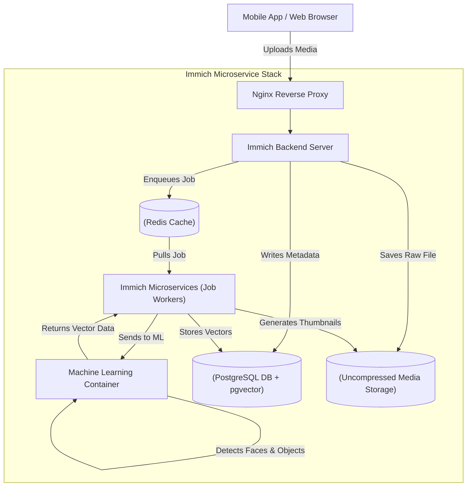

### What is Immich?

Immich is a massively scalable, high-performance, self-hosted photo and video backup solution explicitly designed as a direct, open-source alternative to Google Photos and Apple iCloud. It provides native mobile applications (for iOS and Android) that automatically back up media in the background, paired with a remarkably fast web interface for viewing and organizing albums.

What separates Immich from legacy open-source photo galleries is its heavy integration of advanced machine learning. Immich automatically scans uploaded photos to perform facial recognition, object detection, and semantic search, allowing users to search their library for complex queries like "dogs playing on the beach" or cluster photos by specific family members.

#### Architectural Overview: The Microservice Stack

Immich is not a simple, monolithic application (like a standard WordPress site). It is a complex, modern **microservice architecture**. To function, it requires deploying several interconnected, highly specialized containers.



When a user uploads a photo, the Backend Server saves the raw file to disk and records the EXIF metadata in PostgreSQL. It then drops a "Job" into the Redis cache. The background Microservices container picks up the job, generates web-friendly thumbnails, and passes the image to the Machine Learning container. The ML container runs a neural network to identify faces and objects, returning "vector embeddings" (mathematical representations of the image) which are stored in the database for future semantic searching.

---

### The Home Lab Role

Personal photos and videos are among the most sensitive and irreplaceable data a person owns. Entrusting them to Big Tech corporations means surrendering data sovereignty; cloud providers reserve the right to scan your images, use them for AI training, or terminate your account without recourse.

Immich reclaims that ownership. It runs entirely on your home server, storing the original, uncompressed, unmodified files directly on your local hard drives. It performs all its machine learning tasks entirely locally, ensuring no third party ever scans your memories. 

Furthermore, unlike cloud providers that charge recurring monthly fees when you exceed 15GB of storage, a home lab allows you to store terabytes of 4K video for a fraction of the cost.

---

### Real-World Deployment Scenarios

Deploying Immich provides direct, 1-to-1 experience with the architecture used by massive tech companies. 

1. **Microservice Scalability:** In an enterprise environment, microservices allow specific parts of an app to scale independently. If millions of users suddenly start uploading photos, an enterprise can spin up 50 extra "Backend Server" containers while leaving the "Machine Learning" container alone.
2. **Asynchronous Job Queues:** The use of Redis to queue background tasks (like thumbnail generation) is a ubiquitous pattern in software engineering. It ensures that the web server remains fast and responsive, offloading heavy processing tasks to background workers.
3. **Vector Databases:** The integration of the `pgvector` extension into PostgreSQL represents the cutting edge of database technology. Storing AI embeddings directly in the database is exactly how enterprise RAG (Retrieval-Augmented Generation) applications perform semantic searches across millions of corporate documents.

---

### Configuration Snippet: Infrastructure as Code

Because Immich is a microservice stack, its `docker-compose.yml` file is complex, orchestrating a database, a cache, and multiple application layers.

Here is an excerpt of a standard Immich deployment:

```yaml
version: "3.8"

services:
  immich-server:
    container_name: immich_server
    image: ghcr.io/immich-app/immich-server:${IMMICH_VERSION:-release}
    # Command dictates this container runs the main web server
    command: [ "start.sh", "immich" ]
    volumes:
      - ${UPLOAD_LOCATION}:/usr/src/app/upload
    depends_on:
      - redis
      - database

  immich-microservices:
    container_name: immich_microservices
    image: ghcr.io/immich-app/immich-server:${IMMICH_VERSION:-release}
    # Command dictates this identical image runs as a background worker
    command: [ "start.sh", "microservices" ]
    volumes:
      - ${UPLOAD_LOCATION}:/usr/src/app/upload
    depends_on:
      - redis
      - database

  immich-machine-learning:
    container_name: immich_machine_learning
    image: ghcr.io/immich-app/immich-machine-learning:${IMMICH_VERSION:-release}
    volumes:
      # Mount cache for downloaded machine learning models
      - model-cache:/cache

  redis:
    container_name: immich_redis
    image: redis:6.2-alpine@sha256:84882e87b54734154586e5f8abd4dce69fe7311315e2fc6d67c29614c8de2672

  database:
    container_name: immich_postgres
    # Immich requires a custom Postgres image bundled with the pgvector extension
    image: tensorchord/pgvecto-rs:pg14-v0.2.0@sha256:90724186f0a3517cf6914295b5ab410db9ce23190a2d9d0b9dd6463e3fa298f0
    environment:
      POSTGRES_PASSWORD: ${DB_PASSWORD}
      POSTGRES_USER: ${DB_USERNAME}
      POSTGRES_DB: ${DB_DATABASE_NAME}
    volumes:
      - pgdata:/var/lib/postgresql/data
```

---

### Educational Value for IT Students

Immich is widely considered the ultimate "capstone" deployment for a home lab. It synthesizes almost every concept in modern systems administration. 

- **Microservice Architectures:** Students learn how to orchestrate a stack where multiple containers must communicate with each other over internal Docker bridge networks to form a cohesive application.
- **Database Administration:** Managing the PostgreSQL container teaches students how to perform database dumps, handle schema migrations during software updates, and utilize the `pgvector` extension.
- **Data Sovereignty & Backups:** Handling irreplaceable personal photos teaches the critical, stressful importance of the 3-2-1 backup strategy (3 copies of the data, on 2 different media, with 1 offsite backup). 
- **Machine Learning Integration:** Students see firsthand how pre-trained computer vision models (like ResNet or CLIP) are deployed locally to provide consumer-grade semantic search features without relying on cloud APIs.
