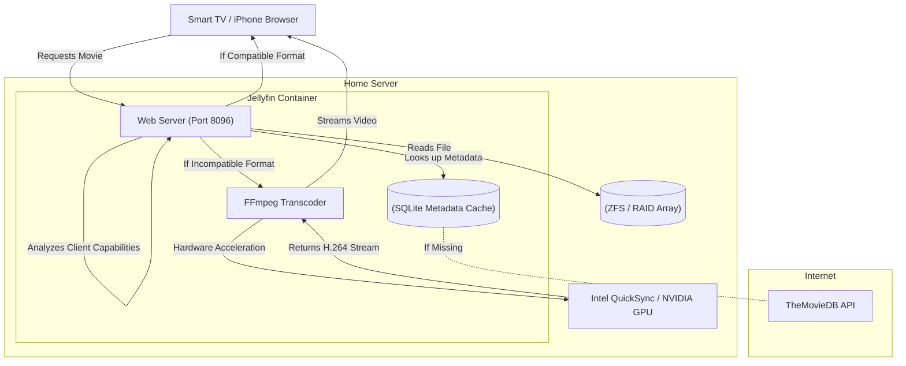

### What is Jellyfin?

Jellyfin is a completely free, volunteer-built software media system that puts you in absolute control of managing and streaming your digital media. It operates as a direct, open-source alternative to proprietary solutions like Plex or Emby. 

It organizes your local movies, TV shows, and music into a beautiful, Netflix-style interface that can be streamed to web browsers, smart TVs (Roku, Apple TV, Android TV), and mobile devices. Unlike Plex, Jellyfin has no premium tiers, no tracking, and no centralized authentication servers.

#### Architectural Overview: The Media Streaming Pipeline

Streaming high-definition media from a server to a client device requires a robust pipeline. The most critical component of this pipeline is **Transcoding**—the process of converting a video file from one format or resolution into another on-the-fly.



When a user presses "Play" on a 4K HDR `.mkv` file on their iPhone, Jellyfin checks if the iPhone natively supports that video codec and audio format. If it does not, Jellyfin spins up an FFmpeg process. FFmpeg reads the file from the hard drive, offloads the heavy video conversion math to the server's GPU (Hardware Transcoding), and streams a compressed, compatible format (like 1080p H.264) to the phone in real-time.

---

### The Home Lab Role

With commercial streaming services becoming increasingly fragmented, constantly raising prices, and arbitrarily removing content from their libraries, many users are returning to local media curation (the "digital DVD shelf").

Jellyfin serves as the core media engine of the home lab. 
- **True Offline Capability:** Because it does not rely on third-party authentication servers to verify user accounts, your media is always accessible on your local network, even if your ISP goes completely offline.
- **Metadata Scraping:** When you drop a video file named `The Matrix (1999).mp4` into a folder, Jellyfin automatically connects to public APIs (like TMDB or TVDB) to scrape high-resolution posters, cast lists, ratings, and synopses.
- **Multi-User Management:** The system allows administrators to create separate profiles for family members, tracking watch progress individually and restricting access to mature content using parental controls.

---

### Real-World Deployment Scenarios

The architecture behind a personal media server is a scaled-down replica of the Content Delivery Networks (CDNs) utilized by streaming giants like Netflix, Disney+, and Amazon Prime.

1. **Video Engineering:** Companies like Netflix employ massive server farms entirely dedicated to transcoding. They use FFmpeg to pre-encode a single movie into dozens of different resolutions and bitrates to support every conceivable device on earth.
2. **Dynamic Adaptive Streaming over HTTP (DASH):** Modern streaming protocols (like DASH or Apple's HLS) break video files into tiny 3-second "chunks." Jellyfin uses these exact same protocols to allow clients to smoothly drop to a lower resolution if their Wi-Fi signal degrades.
3. **Storage Tiering:** Managing massive media libraries requires enterprise-level storage architecture. IT professionals use systems like TrueNAS (ZFS) or Unraid to manage massive hard drive arrays, balancing read speeds with parity protection.

---

### Configuration Snippet: Infrastructure as Code

Deploying Jellyfin via Docker requires passing through specific hardware devices from the host operating system into the container so that FFmpeg can access the GPU for hardware transcoding.

Here is an example `docker-compose.yml` configured for an Intel processor (utilizing QuickSync Video):

```yaml
version: '3.8'
services:
  jellyfin:
    image: lscr.io/linuxserver/jellyfin:latest
    container_name: jellyfin
    environment:
      - PUID=1000
      - PGID=1000
      - TZ=America/Chicago
    volumes:
      # Persistent storage for metadata, posters, and the database
      - ./config:/config
      # Read-only mount of the media arrays
      - /mnt/storage/movies:/data/movies:ro
      - /mnt/storage/tvshows:/data/tvshows:ro
    ports:
      - "8096:8096"
    devices:
      # Pass through the Intel integrated GPU for hardware transcoding
      - /dev/dri/renderD128:/dev/dri/renderD128
    restart: unless-stopped
```

By ensuring the media volumes are mounted as read-only (`:ro`), the administrator guarantees that a bug in Jellyfin or a rogue user cannot accidentally delete the underlying media files.

---

### Educational Value for IT Students

Deploying a media server touches on several critical aspects of systems administration, networking, and storage engineering:

- **Hardware Transcoding:** Students learn the monumental difference between CPU-based software encoding (which will easily max out a CPU at 100% usage) and specialized GPU ASICs (Application-Specific Integrated Circuits) like Intel QuickSync or NVIDIA NVENC.
- **Bandwidth Management:** The project forces an understanding of video bitrates, compression algorithms (H.264 vs H.265/HEVC), and the network requirements necessary to stream high-bandwidth 4K media across a LAN or a constrained WAN connection.
- **Storage Engineering:** Managing terabytes of data introduces students to concepts like RAID arrays, filesystem permissions (UID/GID), and the importance of checksums to prevent silent data corruption (bit rot).
