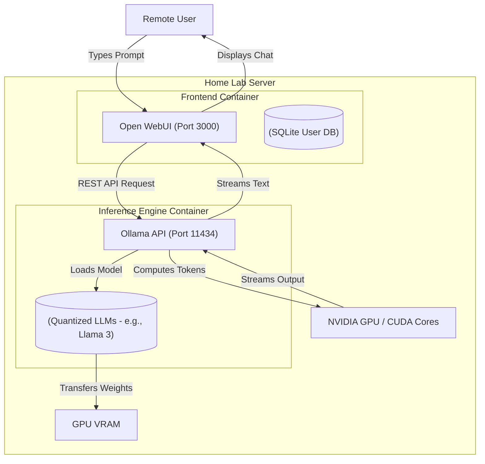

### What is Open WebUI?

Open WebUI is a highly extensible, feature-rich frontend interface designed to operate seamlessly with local Large Language Models (LLMs). Visually and functionally similar to ChatGPT, it provides an intuitive, web-based chat experience. 

However, unlike commercial AI platforms, Open WebUI does not process anything itself. Instead, it acts as a client that connects to a local AI inference engine (most commonly **Ollama**) running directly on your own hardware. This guarantees that your prompts, code, and personal data never leave your internal network.

#### Architectural Overview: The Local AI Stack

To run generative AI locally, the architecture must be split into three distinct layers: the web frontend (Open WebUI), the inference engine (Ollama), and the hardware accelerator (the GPU).



When a user submits a prompt, Open WebUI formats it and sends it via a REST API to Ollama. Ollama loads the requested model (like Meta's Llama 3 or Mistral) entirely into the GPU's VRAM. The GPU's CUDA cores perform the massive matrix multiplications required for token generation, and the resulting text is streamed back to the user in real-time.

---

### The Home Lab Role

As generative AI becomes deeply integrated into daily workflows, the privacy implications of sending sensitive data—such as proprietary source code, financial documents, or personal journals—to cloud providers become a severe security concern. 

By hosting Open WebUI in a home lab:
- **Absolute Privacy:** You create an air-gapped AI assistant. You can confidently paste internal company code into the chat for debugging without violating corporate NDAs or feeding the cloud provider's training data.
- **Cost Efficiency:** You gain access to state-of-the-art conversational AI without paying any monthly subscription fees (like ChatGPT Plus or GitHub Copilot).
- **Custom System Prompts:** Open WebUI allows administrators to create "Modelfiles," defining custom personas (e.g., configuring the AI to act exclusively as a cynical senior Linux sysadmin).

---

### Real-World Deployment Scenarios

The push toward local, private AI inference is one of the fastest-growing sectors in enterprise IT. 

1. **Enterprise RAG (Retrieval-Augmented Generation):** Corporations are deploying this exact architecture internally. Instead of relying on the LLM's general knowledge, they connect Open WebUI to a vector database containing their internal company wikis and HR policies. When an employee asks a question, the AI retrieves the exact company document and summarizes it.
2. **On-Premise Code Assistants:** Defense contractors and highly regulated financial institutions legally cannot use cloud-based AI tools. They deploy massive clusters of local GPUs running open-source models to provide their developers with secure, air-gapped coding assistants.
3. **Edge AI Processing:** Hospitals are beginning to run local AI inference engines on medical carts to transcribe doctor-patient conversations and generate clinical notes locally, ensuring strict compliance with HIPAA privacy laws.

---

### Configuration Snippet: Infrastructure as Code

Deploying a local AI stack requires careful Docker Compose configuration, particularly to pass through the host machine's GPU to the container using the NVIDIA Container Toolkit.

```yaml
version: '3.8'

services:
  # The Inference Engine
  ollama:
    image: ollama/ollama:latest
    container_name: ollama
    restart: always
    volumes:
      # Persistent storage for the downloaded model weights
      - ./ollama_data:/root/.ollama
    ports:
      - "11434:11434"
    # Pass the host's GPU into the container for hardware acceleration
    deploy:
      resources:
        reservations:
          devices:
            - driver: nvidia
              count: 1
              capabilities: [gpu]

  # The Web Frontend
  open-webui:
    image: ghcr.io/open-webui/open-webui:main
    container_name: open-webui
    restart: always
    ports:
      - "3000:8080"
    volumes:
      - ./webui_data:/app/backend/data
    environment:
      # Tell the frontend where to find the Ollama API
      - OLLAMA_BASE_URL=http://ollama:11434
```

Once spun up, the administrator simply visits port 3000, creates an admin account, and clicks a button to automatically download a model (like `llama3:8b`) directly into Ollama.

---

### Educational Value for IT Students

For IT students, deploying a local LLM stack is the most practical way to demystify the "magic" behind modern artificial intelligence.

- **AI Hardware Acceleration:** Students learn exactly why GPUs are required for AI. They monitor `nvidia-smi` in the terminal to watch massive multi-gigabyte models load into VRAM, and observe how running out of VRAM forces the model to offload to the much slower system RAM.
- **Model Quantization:** Massive models (like Llama 3 70B) natively require hundreds of gigabytes of RAM. Students learn about "Quantization"—the process of mathematically compressing a model's floating-point precision (e.g., from 16-bit to 4-bit) so it can fit on consumer-grade gaming GPUs.
- **API Architecture:** By separating the frontend UI from the backend inference engine, students gain hands-on experience with stateless REST APIs and real-time data streaming over HTTP.
- **Vector Databases & RAG:** Advanced students can integrate Open WebUI with a document embedding engine, learning the foundational mechanics of how AI models search and interpret external PDF and Markdown files.
