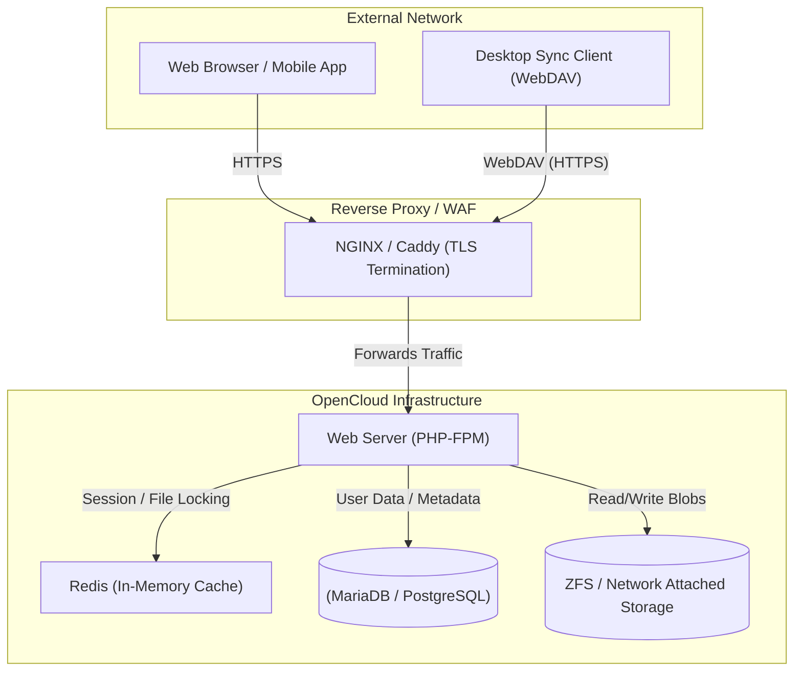

### What is OpenCloud?

OpenCloud (commonly deployed via platforms like Nextcloud or ownCloud) is a suite of client-server software that allows individuals and enterprises to create and host personal cloud storage services. Unlike commercial offerings such as Google Drive, Dropbox, or Microsoft OneDrive, OpenCloud provides a completely self-hosted infrastructure. This ensures that users retain absolute control over their data, privacy, and sharing compliance.

Beyond simple file syncing, modern OpenCloud platforms have evolved into full-fledged collaboration hubs. They integrate calendar management, contact synchronization (CardDAV/CalDAV), real-time document editing, and Kanban boards, transforming a standard file server into a complete digital workspace.

#### Architectural Overview: The Private Cloud

A robust OpenCloud deployment relies on a classic web-stack architecture (often LAMP or LEMP) optimized for heavy I/O operations and secure external access.



In this architecture, the Web Server acts as the traffic director. Because file syncing generates immense numbers of small file operations, an in-memory cache like Redis is critical for handling file locking (preventing two users from overwriting a file simultaneously). The physical file blobs are stored on robust backend storage, while user permissions and file metadata live in the SQL database.

---

### The Home Lab Role

In a home lab, an OpenCloud deployment is often the primary vehicle for "de-Googling" one's digital life.

- **Data Sovereignty:** By hosting your own cloud, you eliminate the risk of commercial algorithms scanning your personal documents, photos, or financial records for advertising telemetry.
- **Unrestricted Scaling:** Commercial clouds charge exorbitant monthly fees for terabytes of storage. In a home lab, expanding your cloud storage is as simple and inexpensive as adding another hard drive to your ZFS pool.
- **Seamless Synchronization:** OpenCloud provides clients for Windows, macOS, Linux, iOS, and Android, ensuring that photos taken on a smartphone are instantly backed up and available across all personal workstations.

---

### Real-World Deployment Scenarios

Deploying an OpenCloud platform mirrors the challenges of managing enterprise file infrastructure and compliance architectures.

1. **Enterprise Data Compliance (HIPAA/GDPR):** Hospitals and law firms cannot legally store sensitive client data on generic public clouds. Deploying an on-premise OpenCloud solution guarantees data residency and compliance with strict regulatory frameworks.
2. **Federated Cloud Sharing:** OpenCloud platforms support "Federation," allowing an organization's server to securely share folders with a completely different organization's server, establishing a peer-to-peer network of trusted private clouds.
3. **High-Performance Caching:** Learning to tune PHP-FPM workers and configure Redis for file-locking prepares administrators to scale web applications for thousands of concurrent enterprise users.

---

### Configuration Snippet: Performance Tuning

Out of the box, an OpenCloud container is functional but not optimized for heavy loads. Systems administrators must configure aggressive caching mechanisms to ensure responsive syncing.

Here is an example `config.php` snippet demonstrating how to configure Redis for distributed caching and transactional file locking:

```php
<?php
$CONFIG = array (
  // Define the trusted reverse proxy to prevent spoofing
  'trusted_proxies' => 
  array (
    0 => '192.168.1.50',
  ),
  
  // Configure Redis for Memory Caching
  'memcache.local' => '\OC\Memcache\APCu',
  'memcache.distributed' => '\OC\Memcache\Redis',
  
  // Configure Redis for Transactional File Locking
  'memcache.locking' => '\OC\Memcache\Redis',
  'redis' => 
  array (
    'host' => 'redis', // The hostname of the Redis container
    'port' => 6379,
    'timeout' => 1.5,
  ),
  
  // Enforce strict security headers
  'front_controller_active' => true,
  'hashing_default_password' => true,
);
```

By offloading the transactional file locking from the SQL database to Redis, the system can handle thousands of simultaneous sync requests without bottlenecking the database engine.

---

### Educational Value for IT Students

Building and maintaining a private cloud exposes students to a wide array of critical IT disciplines.

- **Storage Architecture:** Students learn the difference between block storage, file storage, and object storage, and must implement robust RAID or ZFS topologies to prevent data loss.
- **Web Server Optimization:** Tuning a LAMP/LEMP stack (configuring PHP memory limits, max execution times, and NGINX client body sizes) is a foundational skill for any web systems administrator.
- **Identity Management:** OpenCloud platforms integrate heavily with LDAP, Active Directory, and SAML/SSO. Connecting the cloud to an external identity provider teaches students how enterprise authentication actually functions.
- **Backup Strategy:** Because this server houses critical personal data, it forces students to implement and test automated, off-site database and filesystem backup routines.
