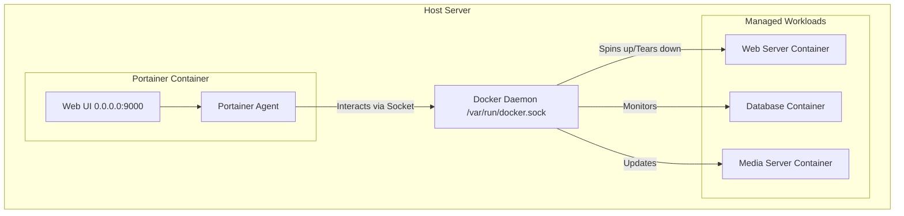

### What is Portainer?

Portainer is a powerful, lightweight management UI that fundamentally transforms how administrators interact with containerized environments. While Docker Engine provides a robust Command Line Interface (CLI), managing dozens of containers, networks, and persistent data volumes across multiple nodes exclusively via terminal commands becomes highly error-prone and time-consuming. 

Portainer abstracts the complexity of the Docker API, providing an intuitive, web-based dashboard to deploy, configure, troubleshoot, and secure container infrastructure. It natively supports standalone Docker engines, Docker Swarm clusters, and even Kubernetes environments, making it a versatile tool for both single-node home labs and multi-node enterprise deployments.

#### Architectural Overview

Portainer itself runs as a lightweight Docker container, interacting directly with the host machine's Docker daemon via a mounted UNIX socket (`/var/run/docker.sock`). This architecture ensures Portainer has the necessary privileges to orchestrate other containers without requiring complex host-level installations.



By communicating directly with the daemon, Portainer accurately reflects the real-time state of all running services, dangling images, and orphaned volumes.

---

### The Home Lab Role

In a home lab environment, visual management is often the key to maintaining a complex infrastructure without burning out. Portainer serves as the central command center for the entire lab. 

Instead of typing `docker ps -a` to see what is running, administrators can log into the Portainer web interface to get an instant visual overview of their environment's health. 
- **Rapid Troubleshooting:** If a service crashes, administrators can click into the container, instantly view the live stdout/stderr logs, and even open a web-based console (exec session) directly into the container's shell to debug the issue.
- **Resource Monitoring:** Portainer provides real-time graphs of CPU, RAM, and Network utilization per container, making it trivial to identify memory leaks or resource hogs.
- **App Templates:** Portainer features an "App Templates" section, allowing users to deploy common services (like Nginx, MariaDB, or WordPress) with a single click, drastically lowering the barrier to entry for beginners.

---

### Real-World Deployment Scenarios

In enterprise environments, the role of Portainer shifts from a simple visual aid to a critical access control mechanism.

In a large organization, you cannot grant every developer root access to the production Docker daemon. Doing so would allow anyone to accidentally delete production databases or spin up unauthorized, vulnerable containers. 

Portainer solves this by introducing **Role-Based Access Control (RBAC)**. 
1. **Authentication Integration:** Portainer integrates with enterprise identity providers like Active Directory (LDAP) or OAuth.
2. **Granular Permissions:** The IT operations team can assign developers "Read-Only" access to production environments (allowing them to view logs but not restart containers) while granting them "Full Control" over staging environments.
3. **Endpoint Management:** A single Portainer instance can manage hundreds of remote "Endpoints" (other servers) by deploying a lightweight Portainer Agent on each node.

---

### Configuration Snippet: Infrastructure as Code

Deploying Portainer is elegantly simple. Because it manages containers, it is deployed as a container itself using Docker Compose. 

Here is the standard `docker-compose.yml` used to bootstrap Portainer on a new host:

```yaml
version: '3.8'

services:
  portainer:
    image: portainer/portainer-ce:latest
    container_name: portainer
    restart: always
    security_opt:
      - no-new-privileges:true
    ports:
      - "8000:8000"
      - "9443:9443"
    volumes:
      # Mount the host's Docker socket to grant Portainer control
      - /var/run/docker.sock:/var/run/docker.sock
      # Create a persistent named volume for Portainer's database
      - portainer_data:/data

volumes:
  portainer_data:
```

Once deployed, administrators navigate to `https://<server-ip>:9443`, create their initial admin credentials, and immediately begin managing the host visually.

---

### Educational Value for IT Students

For students, Portainer acts as the ultimate bridge between theoretical command-line concepts and practical, visual systems administration. 

- **De-mystifying the CLI:** When students execute a complex `docker run` command with multiple volume mounts and port forwards, Portainer allows them to instantly view the resulting container in a GUI, reinforcing what each flag actually did.
- **Understanding Sockets:** Mounting `/var/run/docker.sock` is a critical lesson in Linux security and Inter-Process Communication (IPC). Students learn the risks of granting a container root-level access to the host daemon and the necessity of securing the Portainer web interface.
- **Identity & Access Management (IAM):** Configuring Portainer's internal RBAC or linking it to an external LDAP server provides hands-on experience with enterprise identity management, a foundational skill for cybersecurity roles.
- **Log Aggregation:** Learning how to effectively filter and search container logs to diagnose failing services is a core competency for any future Site Reliability Engineer (SRE) or systems administrator.
