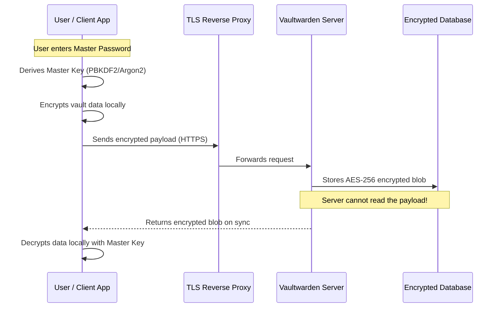

### What is Vaultwarden?

Vaultwarden is an alternative implementation of the Bitwarden server API written in Rust. It provides a highly efficient, lightweight backend that is fully compatible with official Bitwarden browser extensions, mobile apps, and desktop clients. Designed specifically for self-hosted deployments, Vaultwarden allows individuals and organizations to take complete ownership of their digital credentials without relying on third-party cloud services.

While the official Bitwarden server relies on a heavy microservices architecture requiring substantial RAM and MSSQL databases, Vaultwarden compiles into a single, highly performant binary that can run on a Raspberry Pi using a lightweight SQLite database.

#### Architectural Overview: Zero-Knowledge Encryption

The core philosophy behind Vaultwarden (and Bitwarden) is **Zero-Knowledge Encryption**. The server never sees your actual passwords.



In this architecture, all encryption and decryption happen client-side. The Vaultwarden server merely acts as a synchronized storage locker for encrypted blobs. If a malicious actor were to compromise the server and steal the SQLite database, they would only obtain mathematically unreadable ciphertext.

---

### The Home Lab Role

In a home lab environment, a password manager is arguably the most critical piece of self-hosted infrastructure. 

- **Data Sovereignty:** Passwords, TOTP seeds, and secure notes are the keys to a user's digital identity. By hosting Vaultwarden locally, you ensure that these keys never sit on a commercial server that could be breached or sold.
- **Resource Efficiency:** Because it is written in Rust, Vaultwarden consumes mere megabytes of RAM compared to the gigabytes required by enterprise password servers, making it perfect for edge computing or small VMs.
- **Family Management:** Vaultwarden fully supports Bitwarden's "Organizations" feature, allowing home lab administrators to securely share passwords (like Wi-Fi keys or streaming service logins) with family members.

---

### Real-World Deployment Scenarios

Understanding Vaultwarden's architecture directly translates to enterprise Identity and Access Management (IAM).

1. **Enterprise Secrets Management:** In corporate environments, credentials (API keys, database passwords) must be securely stored and rotated. Concepts learned through Vaultwarden map directly to enterprise tools like HashiCorp Vault or CyberArk.
2. **Reverse Proxy & TLS Termination:** Vaultwarden strictly requires HTTPS to function (the Web Crypto API is disabled by browsers on HTTP). Deploying it forces administrators to learn how to properly configure reverse proxies (like Caddy, Nginx, or Traefik) and manage SSL/TLS certificates via Let's Encrypt.
3. **High Availability (HA):** While SQLite is perfect for a home lab, Vaultwarden can be backed by PostgreSQL or MySQL for enterprise deployments, teaching database clustering and HA concepts.

---

### Configuration Snippet: Infrastructure as Code

Deploying Vaultwarden is typically handled via Docker Compose. This ensures the environment is reproducible and isolated.

Here is a standard `docker-compose.yml` snippet demonstrating a secure Vaultwarden deployment:

```yaml
version: '3.8'

services:
  vaultwarden:
    image: vaultwarden/server:latest
    container_name: vaultwarden
    restart: always
    environment:
      # Disable new signups for security once the admin account is created
      - SIGNUPS_ALLOWED=false
      # Enable the admin panel for advanced management
      - ADMIN_TOKEN=$$argon2id$$v=19$$m=65536,t=3,p=4$$hashed_token_here
      # Require users to verify their email
      - SIGNUPS_VERIFY=true
      # Force TLS for the Web Vault
      - DOMAIN=https://vault.example.com
    volumes:
      - ./vw-data:/data
    ports:
      # Expose only locally; a reverse proxy should handle external traffic
      - "127.0.0.1:8080:80"
```

This configuration highlights security best practices, such as disabling open registration, hashing the admin token, and preventing direct exposure to the public internet by binding to `127.0.0.1`.

---

### Educational Value for IT Students

Hosting a secure credential manager is an intense, practical lesson in cybersecurity and systems administration.

- **Cryptography Fundamentals:** Students learn the difference between hashing (for passwords) and symmetric encryption (for vault data), as well as the importance of Key Derivation Functions (like Argon2id) to prevent brute-force attacks.
- **Network Security:** Because password managers are high-value targets, students learn how to secure the perimeter using Web Application Firewalls (WAF), fail2ban, and strict reverse proxy configurations.
- **Disaster Recovery:** A lost password vault is catastrophic. Managing Vaultwarden forces students to implement robust, automated backup strategies (the 3-2-1 backup rule) and regularly test their restoration procedures.
